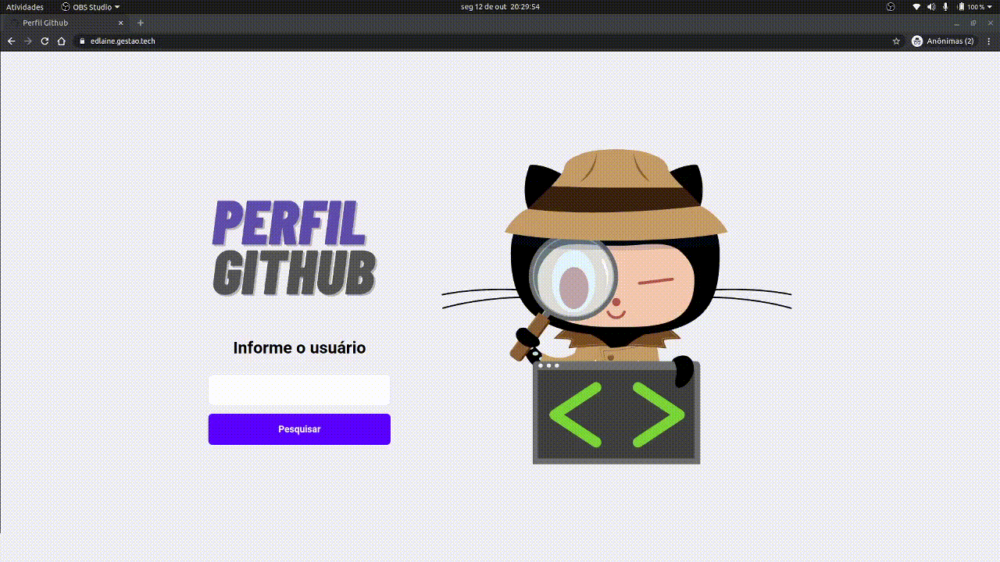

# APP PERFIL GITHUB
______________________________________________

<b>Url:<b> www.edlaine.gestao.tech.com.br 

Você pode pesquisar o usuario e consultar informações gerais como:
Numero de Seguidores;
 

   ✔Quantidade de respositorios publicos; 
   ✔Data de criação do perfil no gihtub; 
   ✔Data de atualização do perfil;  

Através da listagem de repositorios é possivel consultar:
 

   ✔Link do repositório; 
   ✔Data de criação; 
   ✔Numero de forks; 
   ✔Numero de estrelas (dadas por outros usuarios); 
   ✔Ultima Atualização; 
   ✔Descrição; 

###  📚 Como utilizar a aplicação

Informe o usuario que deseja consultar e clique em pesquisar, a aplicação informa se o usuario informado for invalido.
Ao encontrar o usuario sera exebido a pagina de profile, com informações gerais. 
A direira é exibido os repositorios publico, para consultar maiores informações do repositorio clique no <bold>botão R.<bold>

Retorne a tela de busca clicando no botão no canto superior direito.

### 🚀 Tecnologia ###

    - ReactJs

### 👀 Como rodar a apĺicação

1. clone o projeto
    git clone: ghttps://github.com/Edlaine-Pontes/React.git

### 💪 Contribuintes ###

Edlaine Pontes e muito café (acompanhado de algumas lagrimas)
